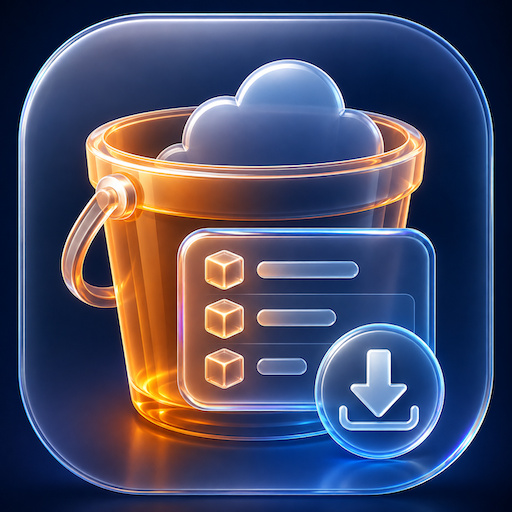
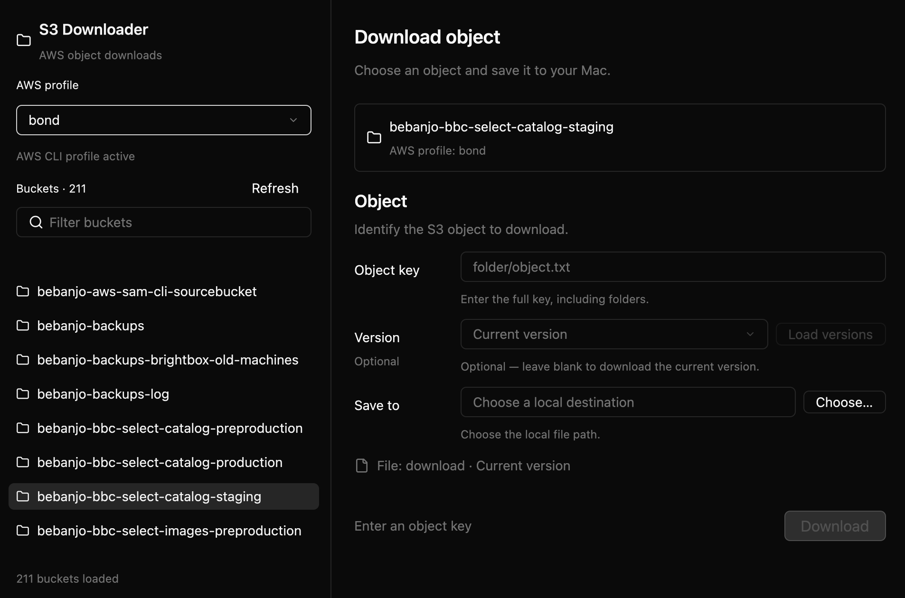

<div align="center">
  
  <h1>S3 Downloader</h1>
  <p><strong>A focused macOS workspace for downloading one object from a client S3 bucket.</strong></p>
  <p>Use the AWS CLI profiles and roles you already trust. Find the bucket, choose the object version, and save the file locally.</p>
  <p>
    
    
    
  </p>
</div>

S3 Downloader is a small native Mac app for the moments when a client gives you
access to an S3 bucket and you need a dependable local copy of a specific file.
It keeps the workflow intentionally narrow: no object browser, no uploads, and
no credential store—just a clear path from an AWS profile to a downloaded file.

## Why teams use it

<table>
  <tr>
    <td align="center" width="33%">
      
      <br /><strong>Profile-first access</strong>
      <br />Choose the AWS CLI profile or role you already use, then see its buckets in one place.
    </td>
    <td align="center" width="33%">
      
      <br /><strong>Version-aware downloads</strong>
      <br />Inspect versions for an exact key and make historical-file requests explicit.
    </td>
    <td align="center" width="33%">
      
      <br /><strong>Local, predictable output</strong>
      <br />Choose a destination with the native save dialog and keep the file on your Mac.
    </td>
  </tr>
</table>

## See it in action

This section is a ready-to-replace screenshot slot. The placeholder keeps the
README useful until a final product screenshot is available.

<p align="center">
  
</p>

## The workflow

1. **Choose an AWS profile.** Profiles are read from `~/.aws/config` and shown
   at the top of the Sidebar.
2. **Choose a bucket.** Filter the loaded bucket list locally, refresh it when
   needed, or enter a bucket name manually when the profile cannot list buckets.
3. **Identify the object.** Enter the full S3 key, including folders. Press
   Enter or choose **Load versions** to inspect available versions.
4. **Choose what to download.** Leave the version selector on **Current version**
   for the latest object, or select a specific version ID for a historical copy.
5. **Save the file.** Choose a local destination and press **Download**.

The selected profile and bucket stay visible as quiet context while you work,
and the app reports loading, success, and AWS errors in the workspace.

## Role-based access, without another credential store

S3 Downloader delegates authentication and role resolution to the AWS CLI. This
means your existing profiles, SSO sessions, environment variables, and role
configuration remain the source of truth. The app does not read, display, or
persist secret keys.

For example, configure or validate a profile before opening the app:

```sh
aws configure --profile staging
aws sts get-caller-identity --profile staging
```

For an SSO-backed profile, sign in first:

```sh
aws sso login --profile staging
```

## Features

- Reads AWS profile names from `~/.aws/config`.
- Lists and locally filters buckets for the selected profile.
- Refreshes buckets without losing a still-valid selection.
- Preserves the manual bucket-entry fallback when listing is denied.
- Loads object versions for an exact key with Enter or **Load versions**.
- Downloads the current/latest object when no version is selected.
- Downloads a specific object version when one is selected.
- Uses the native macOS save-file dialog.
- Shows download progress, success messages, and AWS CLI errors.
- Provides a native `S3 Downloader → Quit` menu item and `⌘Q` shortcut.
- Builds an Apple Silicon `.app` bundle and `.dmg` installer.

## Requirements

- macOS.
- Rust and Cargo. Install them with [rustup](https://rustup.rs/).
- AWS CLI v2 installed and configured.
- `cargo-packager` for creating the macOS application and DMG.
- The Apple Silicon Rust target when building the packaged release:

  ```sh
  rustup target add aarch64-apple-darwin
  ```

The application reads profile names from `~/.aws/config`. For example:

```ini
[default]
region = eu-west-1

[profile staging]
region = eu-west-1
```

## Run locally

From the project directory:

```sh
cargo run
```

Useful verification commands are:

```sh
cargo fmt --check
cargo check
cargo test
cargo clippy
cargo build --release
```

The application opens a window titled `S3 Downloader`.

## Build the macOS DMG

Install the packager once if it is not already available:

```sh
cargo install cargo-packager
```

Then run the release script:

```sh
./scripts/build-macos.sh
```

The script:

1. Checks formatting.
2. Runs the tests.
3. Runs Clippy.
4. Builds the Apple Silicon release binary.
5. Creates the `.app` bundle and `.dmg` installer.
6. Prints the generated DMG path.

The output is normally:

```text
target/aarch64-apple-darwin/release/S3 Downloader_0.1.0_aarch64.dmg
```

The exact filename includes the version configured in `Packager.toml`.

To package manually instead:

```sh
cargo build --release --target aarch64-apple-darwin
cargo packager --release
```

Packaging settings are in [`Packager.toml`](Packager.toml). The current
configuration produces an Apple Silicon application with bundle identifier
`com.julengodoy.s3downloader`.

## Install the application

1. Open the generated DMG.
2. Drag `S3 Downloader.app` to `/Applications`.
3. Launch it from Finder or Launchpad.

The package is currently unsigned and not notarized. If macOS blocks the first
launch, Control-click the application, choose **Open**, and confirm the prompt.

## Application icon

The application icon is [`icon_s3_browser.png`](icon_s3_browser.png). The
packager uses the supported 512×512 derivative
[`icon_s3_browser_512.png`](icon_s3_browser_512.png), configured in
`Packager.toml`.

If the original icon is replaced, regenerate the derivative on macOS with:

```sh
sips -z 512 512 icon_s3_browser.png --out icon_s3_browser_512.png
```

Then run `./scripts/build-macos.sh` again.

## AWS CLI permissions

The selected AWS identity generally needs:

- `s3:ListAllMyBuckets` to load the bucket list.
- `s3:ListBucketVersions` to load versions for an object key.
- `s3:GetObject` to download the current object.
- `s3:GetObjectVersion` when downloading a specific version.

AWS errors such as `AccessDenied`, expired authentication, missing objects,
and network failures are displayed in the application.

## AWS CLI PATH troubleshooting

Applications launched from Finder may receive a different `PATH` than shells
launched from Terminal. The application first checks `PATH` and then checks
these common macOS AWS CLI locations:

```text
/usr/local/bin/aws
/opt/homebrew/bin/aws
/usr/local/aws-cli/v2/current/bin/aws
```

Verify the CLI from a terminal with:

```sh
command -v aws
whence -p aws
aws --version
```

If the AWS CLI works in Terminal but not in the packaged app, confirm that the
binary is executable and installed in one of the locations above, or launch
the application from a shell with the correct `PATH`.

## Project structure

```text
src/
├── main.rs                  # GPUI bootstrap and native application menu
├── app.rs                   # Application-level state transitions
├── aws/
│   ├── cli.rs               # AWS CLI command execution and parsing
│   └── profiles.rs          # ~/.aws/config profile parsing
├── models/
│   └── app_state.rs         # Form state and download validation
└── ui/
    └── main_window.rs       # GPUI form and user interactions

docs/images/                 # README feature icons and screenshot slot
Packager.toml                # macOS app and DMG configuration
scripts/build-macos.sh       # Release verification and packaging script
```

## Current limitations

- The packaged release targets Apple Silicon (`aarch64-apple-darwin`) only.
- The application downloads one explicitly selected object at a time.
- It does not browse objects or manage AWS credentials.
- Signing and notarization are not configured.
